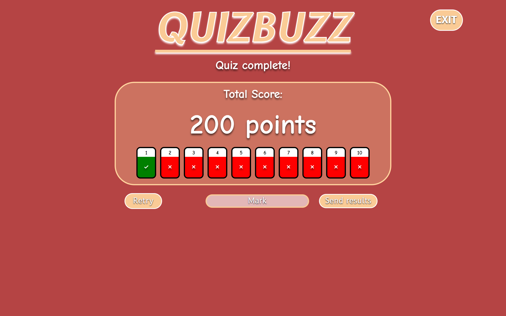
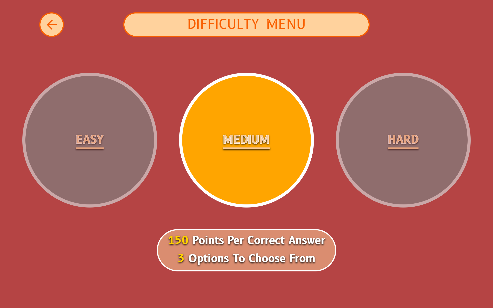

# QuizGame

This is a Spring Boot Java web application[^1].
The backend is based on a SQL embedded DBMS (Apache Derby) managed through Spring Data JPA and Hibernate ORM.
The frontend scripts are written in JavaScript and make use of the Fetch API and async/await syntax.
The structure and presentation layers are written in pure HTML5 and CSS3.
The application is made responsive through the use of CSS media query and breakpoints.

Some external resources are embedded to improve the presentation and functionality: Normalize.css, SimpleBar, Google Fonts, LogBack.

Data sent to the Database is validated in order to guarantee data integrity and prevent SQL Injection.

[^1]: The application is served on port 3000

## MANUAL

### Home Page

In the home page the user can choose one of 4 options:
 - start
 - settings
 - leaderboard
 - tutorial

### Start

Once selected, the quiz will start. The user will be presented with 10 sentences to complete. The total score will be shown at the end of the quiz and the user can choose to save the result on the leaderboard or discard it and retry.

### Settings

Here the user can set the game options:
 - Difficulty
 - Topic

#### Difficulty

The user can choose between:
 - Easy:    100 points per correct answer, 2 possible answers.
 - Medium:  150 points per correct answer, 3 possible answers.
 - Hard:    200 points per correct answer, 4 possible answers. 
    

#### Topic

The user can choose between:
 - History: 10 random history quotes.
 - Movies: 10 random movie quotes.
 - Latin: 10 random latin quotes.
 

##### Note: Settings are saved locally on the browser as soon as selected. As long as the player uses the same browser on the same device, settings will be retained between sessions

### Leaderboard

The leaderboard shows the top 100 (maximum) best players, sorted by score. Two players with the same score will be ordered by the timestamp associated with the score.
On the leaderboard, every player will only appear once.

### Tutorial

Here the user will find a brief explanation of the game rules and an interactive example of a question.

